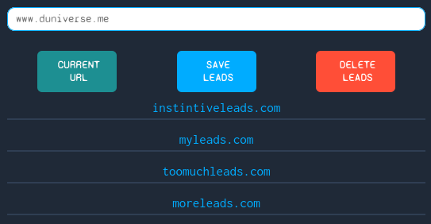

<h1 align="center">Welcome to url-tracker 👋</h1>

  
  
  
  

> This addon renders leads that you want to save from the internet, as well as tab links that are important for later.

> It saves your precious URL's, and text if you'd like, those that you want to come back to at a later instance. And it lets you keep them as long as you want.

## Link to project

🏠 [Homepage](https//github.com/dunivers3/url-tracker#readme)

### How it's made:

> <strong>Tech used: </strong> HTML, CSS, Javascript.  
> This is a regular <a href="https://www.google.com/chrome/" target="_blank" >Google Chrome </a> extension.
> The extension uses the browser's local storage to listen and store the current browser url the client is on, or any lead they feed directly into the input. Javascript is used to get listen to the respective buttons the client targets, to grab and save, delete or edit a lead/url.
> HTML and CSS is used to design the look and feel of the extension.

## Optimizations:

-   Adds .crx file to a database to make the extension downloadable to the client.

## Lessons learnt:

> -   Security aware clients' priority is to be safe while working with browsers. This project creates confidence and increasese security side of the client, saving their priority leads localy in their local machines, and not entirely depending on browser sync.
> -   “Computer science inverts the normal. In normal science, you're given a world, and your job is to find out the rules. In computer science, you give the computer the rules, and it creates the world.” — Alan Kay, Developer, Computer Scientist, and Father of Object-Oriented Programming

## Author

👤 **Duncan**

-   Website: www.duniverse.me
-   Twitter: [@\_duniverse](https://twitter.com/_duniverse)
-   Github: [@dunivers3](https://github.com/dunivers3)
-   LinkedIn: [@duniverse](https://linkedin.com/in/duniverse)

## 🤝 Contributing

Contributions, issues and feature requests are welcome! Feel free to check [issues page](https://github.com/dunivers3/url-tracker/issues). You can also take a look at the [contributing guide](https://github.com/dunivers3/url-tracker/pulls).

## Design

Css has been generated using sass lang

Give a ⭐️ and tell a friend if this project helped you!

## 📝 License

Copyright © 2022 [Duncan](https://github.com/dunivers3). 
This project is [MIT](https://github.com/dunivers3/url-tracker/blob/main/LICENSE) licensed.
